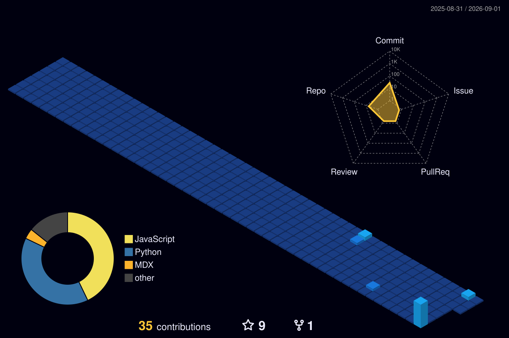

<div align="center">

  <!-- DYNAMIC AESTHETIC WAVING HEADER BANNER -->
  

  <!-- TYPING EFFECT -->
  <p align="center">
    
  </p>

  <p align="center">
    <em>Full-Stack Developer passionate about crafting modern web ecosystems, AI agents, and high-performance clean architecture.</em>
  </p>

</div>

---

### 🏆 3D GitHub Achievements & Trophies

<div align="center">
  
</div>

---

### 👨‍💻 About Me

```yaml
name: Musa Abdul Jabbar
role: Full-Stack Developer
location: Indonesia 🇮🇩
passion: Clean Architecture, Full-Stack Development & AI Integration
current_focus: Building scalable web applications & intelligent desktop companions
motto: "Keep learning, keep building, keep innovating."
```

- 🔭 **Currently Building:** [Claryn AI](https://github.com/rsvmusabb/agent-claryn) — *Generative AI Desktop Assistant with Multi-Modal Vision & OS Control.*
- 🚀 **Core Expertise:** Modern Full-Stack Development (Frontend, Backend, APIs, Databases) & AI Automation.
- ⚡ **Fun Fact:** I believe clean, modular code is a form of art.

---

### 🛠️ Tech Stack & Skills

<div align="left">

  <!-- Programming Languages -->
  
  
  
  
  

  <!-- Frameworks & Runtime -->
  
  
  

  <!-- AI & Data -->
  
  
  

  <!-- Tools & DevOps -->
  
  
  

</div>

---

### 🏙️ 3D Isometric Contribution City

<div align="center">
  
</div>

---

### 📊 GitHub Analytics

<div align="center">
  
  
</div>

---

<div align="center">

  <!-- FOOTER BANNER -->
  

  <p>⭐ <em>Thanks for visiting my GitHub profile! Feel free to explore my repositories.</em></p>

</div>
